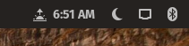

# gnome-sunrise-indicator

A GNOME Shell extension that adds a sunrise/sunset time indicator to the top bar.

Tested on Pop!_OS 18.04 LTS with GNOME Shell 3.28.4.

## Installation
Install the contents of this repository into `~/.local/share/gnome-shell/extensions/sunrise-indicator@alex.studer.dev`.

For ease of development, you can clone this repository and set up a symlink pointing from the path above to wherever you've cloned the code.

## Testing
Shell extensions are only reloaded when the whole shell is reloaded. So, for development purposes, it's best to start a nested instance of GNOME Shell, which you can easily stop and start:
* In one terminal, run `Xephyr :1 -screen 800x600`.
* In another, run `DISPLAY=:1 dbus-run-session -- gnome-shell --x11`.

(make sure to install the extension first!)

## TODO
* Autodetect location, or at least allow changing it manually (right now it's hardcoded)
* Possibly try to be smarter about when we update/reload data?